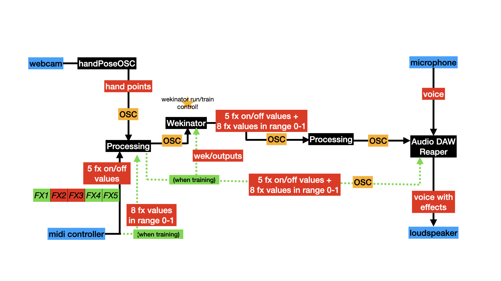
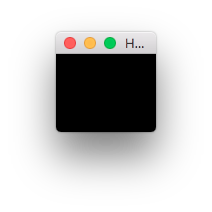
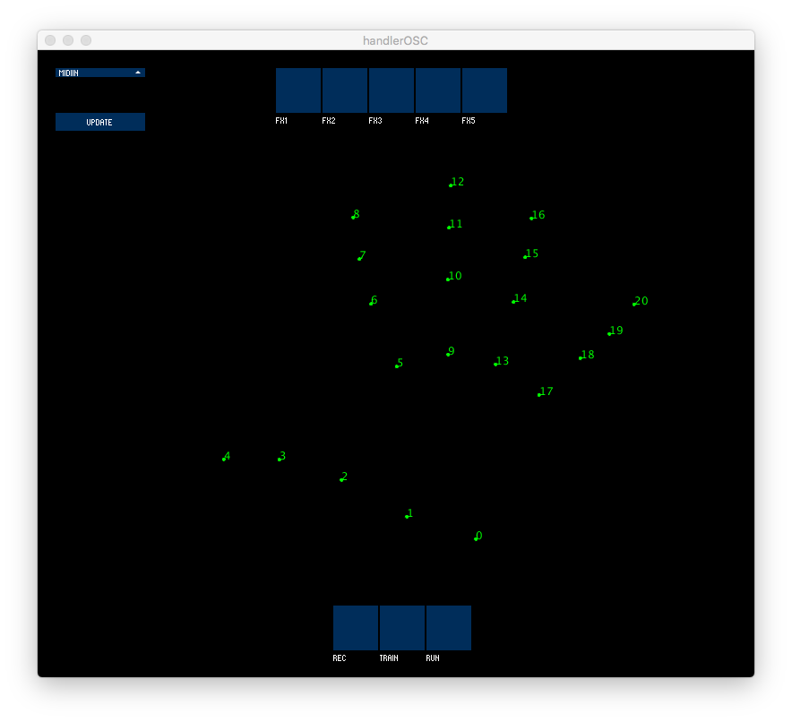
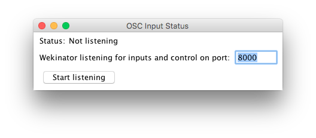
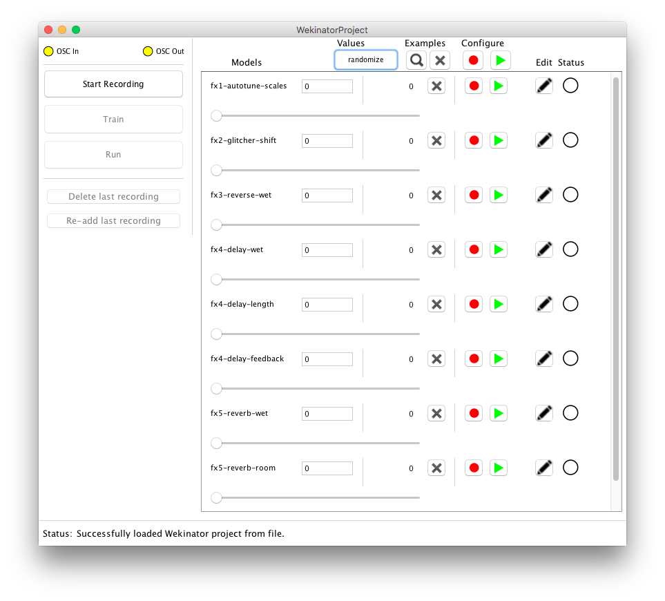
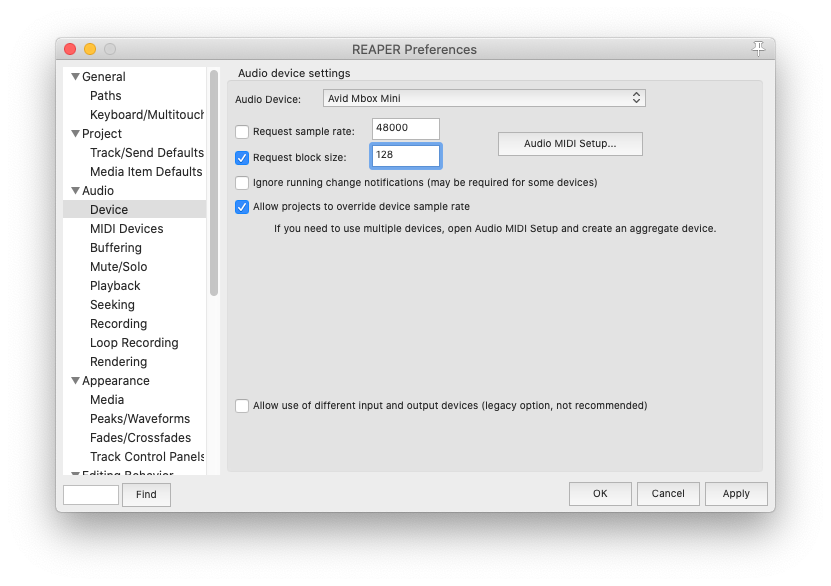
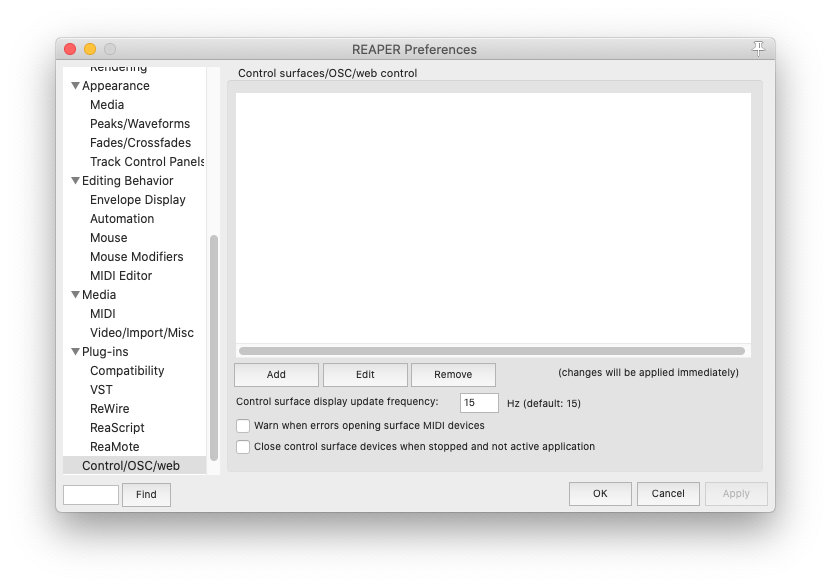
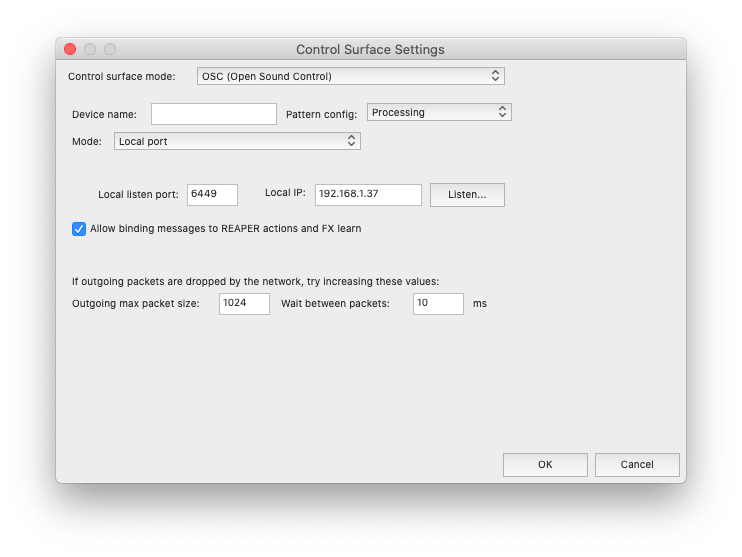

# Wekitunenator 3000
Authors: Teresa Pelinski [@pelinski](https://github.com/pelinski) and Gonzalo Nieto [@gonznm](https://github.com/gonznm).

Wekitunenator 3000 is our final project for the Advanced Interface Design course of the Sound and Music Computing Master at the Music Technology Group, in Universitat Pompeu Fabra (Barcelona).

Wekitunenator is an instrument that applies sound effects in real-time to the user's voice. These effects are selected with a MIDI controller and the parameters regulating them are modified with the user's hand movements. Machine learning is used in mapping hand movements to sound effects values. However, this instrument tries to move away from the conventional notion of machine learning (ML) as a control paradigm and intends to use ML as a discovery tool. This was inspired by Sonami and Fiebrink's paper [Reflections on Eight Years of Instrument Creation with Machine Learning](https://www.nime.org/proceedings/2020/nime2020_paper45.pdf), presented in NIME 2020.

In order to model the mappings between hand positions and effects parameters, Wekinator is used. The model can be trained directly using the MIDI controller by selecting the effects (with buttons) and the parameters values (with knobs) and hitting on the `REC` button. The `REC`, `TRAIN` and `RUN` buttons control the MIDI interface (if no MIDI controller is available, the buttons in the screen interface can also be controlled with the mouse). This way, the user can dynamically train and use the model without having to use the keyboard or mouse. When running the model on unseen combinations of effects, the mappings and hence, the resulting sounds, will be unpredictable.

The hand positions are tracked by a lightweight version of [@faiip](https://github.com/faaip/)'s [handPose-OSC](https://github.com/faaip/HandPose-OSC). The code can be found [here](https://github.com/gonski/HandPose-OSC). The communication between this model, the MIDI controller, Wekinator, and the Digital Audio Workstation (Reaper) is handled by the Processing sketch `handlerOSC`. 
## Pipeline

## Setup
Tested in MacOS Catalina [10.15.7].

### HandPose-OSC
Run `HandPose-OSC.app`. You will see a little black window, which needs to be open in order to track the hand and finger positions.  

This application will start processing information from your camera in order to extract the points of your hand. Now you can open the OSC handler.

### OSC handler
Run `handlerOSC.app`. If HandPose-OSC is also running, you will be able to see the points of your hand in green over a black background. 

Select your MIDI input device and press `UPDATE`. The FX switches are controlled by MIDI pitch indexes 0, 1, 2, 3 and 4. The `REC`, `TRAIN` and `RUN` buttons can be modified with MIDI pitch indexes 5, 6 and 7. If you don't have a MIDI controller device, you can also control Wekitunenator by clicking on the dark blue buttons. The eight effect parameters are controlled by MIDI CC messages 48, 49, 50, 51, 52, 53, 54 and 55. You can also edit them within Reaper's interface with the mouse.

### Wekinator
You can download Wekinator [here](http://www.wekinator.org/downloads/). Once downloaded, open the program and select `File>Open project...`. 

Find the file `wekitunenator/wekProject/WekinatorProject.wekproj` and open it.

You will see this window:

Click on `Start listening` without changing the input port number.

You will be able to see that this Wekinator project receives 27 inputs –hand base points and the distances of the fingers to these points– and sends 13 outputs –five 0/1 integer values and eight floats, which control 5 effects in Reaper.

### Reaper
You can download Reaper [here](https://www.reaper.fm/download.php). Once installed, open `wekitunenator\Reaper\liveInput_FXs.RPP`. You may need to modify your audio device input/output configuration `Preferences>Audio>Device`.

#### Install FXs
Download and install Graillon 2 Live Changer free edition [here](https://www.auburnsounds.com/products/Graillon.html), in order to have auto-tune.

Load user FX presets by dragging and dropping the *presets.ReaperConfigZip* file from Explorer or Finder into REAPER's arrange window.

#### Buffer size
In order to obtain a good real-time performance you should modify the default buffer size in `REAPER>Preferences>Audio>Device`. Check the `Request block size` box and set it to 64. You may need a larger size if you hear clicks, it depends on your computer.

#### Setting up OSC control 
* Go to `Preferences>Control/OSC/web`. Then click on the `Add` button.

* In the `Control Surface Settings`window, in the `Control surface mode` dropdown menu, select `OSC (Open Sound Control)`. In the `Pattern config` menu, select `Processing`. In `Mode`, select `Local port`. Then set `Local listen port` to `6449` and tick the option `Allow binding messages to REAPER actions and FX learn`. You won't need to modify the local IP. Your configuration should look like that (the local IP might look different):

Click on `Ok` and you're ready to go!
