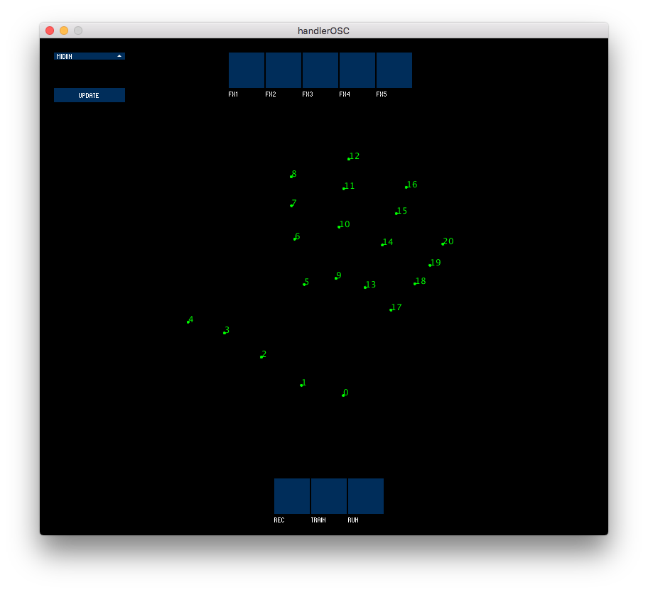

# Wekitunenator
Authors: Gonzalo Nieto [@gonznm](https://github.com/gonznm) and Teresa Pelinski [@pelinski](https://github.com/pelinski).

Wekitunenator 3000 is our final project for the Advanced Interface Design course of the Sound and Music Computing Master at the Music Technology Group, in Universitat Pompeu Fabra (Barcelona). We built an interface that:
* controls audio effects in real time, intended for voice.
* is controlled with the user’s hand (using a camera) and a midi controller.
* goes beyond a control paradigm and uses machine learning (ML) as an exploratory tool.

Wekitunenator is inspired by [Sonami and Fiebrink’s discussion on instrument creation with ML](https://www.nime.org/proceedings/2020/nime2020_paper45.pdf). Instead of being just used to control, ML can provide access to surprise and discovery in mapping creation. Furthermore, mapping can be part of the instrument itself, not independent from it.

In our instrument, Wekinator maps hand positions and midi controller values to Reaper, the Digital Audio Workstation in charge of applying effects to the input signal in real time.
These programs communicate through OSC messages, which are handled by a Processing sketch.

Therefore, there are four main parts:
1. Hand tracking – made by HandPose-OSC and Processing
3. OSC messages handling – done by a Processing sketch
2. Mapping creation – Wekinator
4. Audio and effects managing – handled by Reaper

(icons created by <a href="https://thenounproject.com/eucalyp/">Eucalyp</a> under CCBY license)

Watch a short demo and explanation [here](https://youtu.be/M6bAb42s-lo).

## Setup
This instrument has been tested in an OS X operative system.
### HandPose-OSC
For the hand tracking we are using [handPoseOSC](https://github.com/faaip/HandPose-OSC) by [@faiip](https://github.com/faaip/). 

Double click on HandPose-OSC application. You will see a little black window, which needs to be open although you cannot interact with it. 

This application will start processing information from your camera, to extract the points of your hand. Now you can open the OSC handler.

### OSC handler
Double click on `handlerOSC/handlerOSC.app`, which will run a java application. If HandPose-OSC is also running, you will be able to see the points of your hand –if you are showing it to your camera– in green, on top of a black background. Something like this:

Select your MIDI input device and press `UPDATE`. The FX switches are controlled by MIDI pitch indexes 0, 1, 2, 3 and 4. The REC, TRAIN and RUN buttons can be modified with MIDI pitch indexes 5, 6 and 7. 

### Wekinator
You can download Wekinator [here](http://www.wekinator.org/downloads/). Once downloaded, open the program and select `File>Open project...`. 

Find the file `wekitunenator/wekProject/WekinatorProject.wekproj` and open it.

You will see this window:

Click on `Start listening` without changing the input port number.

You will be able to see that this Wekinator project receives 27 inputs –hand base points and the distances of the fingers to these points– and sends 13 outputs –five 0/1 integer values and eight floats, which control 5 effects in Reaper.

### Reaper
You can download Reaper [here](https://www.reaper.fm/download.php). Once it has been installed, configuration instructions can be found in this [document](./Reaper/README.md). 