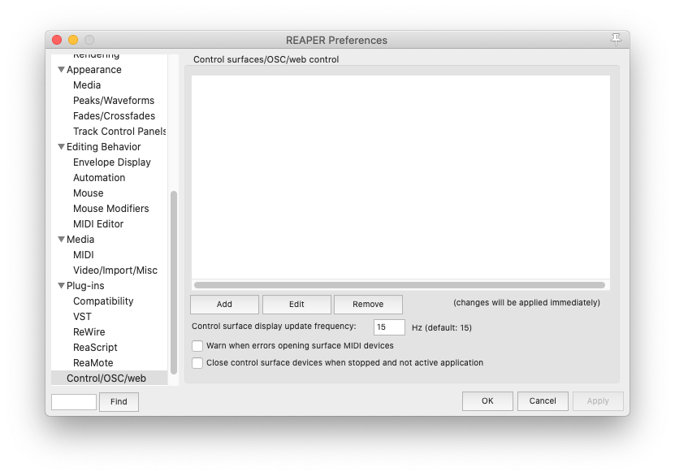
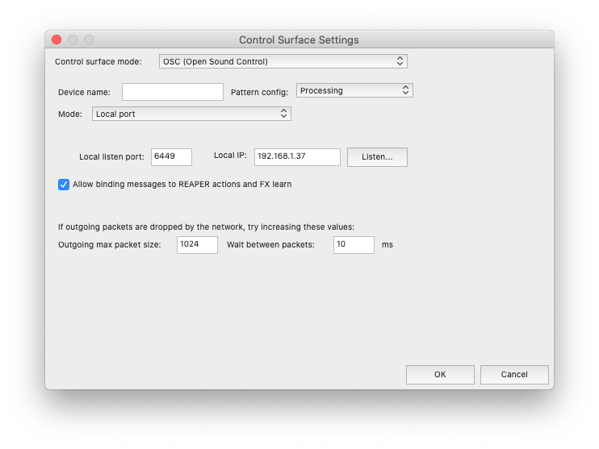

# Reaper configuration 
You may need to modify your audio device input/output configuration `Preferences>Audio>Device`

## Install FXs
Download and install Graillon 2 Live Changer free edition [here](https://www.auburnsounds.com/products/Graillon.html), in order to have auto-tune.

## Setting up OSC control 
Copy and paste `Processing.ReaperOSC` file to your OSC Reaper path (usually `/Users/username/Library/Application Support/REAPER/OSC`). Once you've done that: 
* Go to `Preferences>Control/OSC/web`. Then click on the `Add` button.

* In the `Control Surface Settings`window, in the `Control surface mode` dropdown menu, select `OSC (Open Sound Control)`. In the `Pattern config` menu, select `Processing`. In `Mode`, select `Local port`. Then set `Local listen port` to `6449` and tick the option `Allow binding messages to REAPER actions and FX learn`. You won't need to modify the local IP. Your configuration should look like that (the local IP might look different):

Click on `Ok` and you're ready to go!
